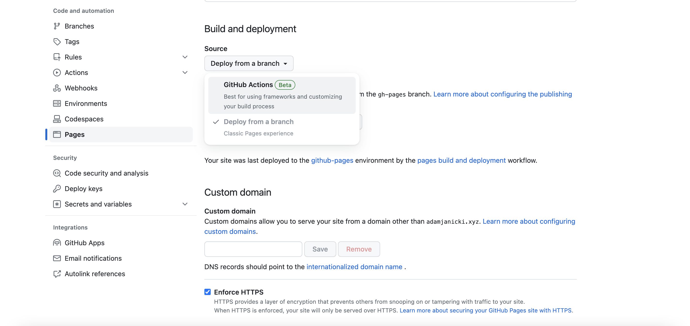

# Static Site Template

This is a barebones template repo built to make setup and deploying your static site to Github pages easier! The overall process is as follows: make a repo from this template, set up Node/VitePress, and then deploy to Github pages. The steps are detailed below! You can check out an example [here](https://61040-fa23.github.io/portfolio-adamjanicki2). If you have any questions, feel free to ask on Discourse or attend studio hours.

## Useful links

- [Example Site](https://61040-fa23.github.io/portfolio-adamjanicki2)
- [VitePress documentation](https://vitepress.dev/)
- [Github Pages documentation](https://docs.github.com/en/pages/getting-started-with-github-pages/about-github-pages)
- [Node.js documentation](https://nodejs.org/en/docs/)

## Pre-setup

You will have to install [Node.js](https://nodejs.org/en/) **v18** to use this template. You can check if you have it installed by running `node -v` in your terminal. If you get an error, or see a version less than 18, you will need to install it. 6.1020 has detailed instructions, which you can find [here](https://web.mit.edu/6.102/www/sp23/tools/getting-started/#install_node).

## Setup Guide

1. Create your repo. We'll be using Github Classroom, so visit the [assignment link](https://classroom.github.com/assignment-invitations/a8bb029c7738241e2e2fb4156736be00/status) to create your repo. _Note: you will receive an email saying that a workflow run was not successful. You can ignore this; we will fix this by completing the rest of the setup_ :smile:
2. Clone your new repo to your local machine.
3. `cd` into your own repo, and then run `npm install` to install the dependencies. _Make sure you've correctly installed Node v18 before doing this step._
4. Run `npm run docs:dev` to start the development server. You should see a message with the `localhost` path where it is deployed; check it to make sure you can see your site.
   
5. Customize your site by searching for and editing all of the `TODO` items in the `docs/index.md` and `docs/.vitepress/config.mts` files.
6. In the `docs/.vitepress/config.mts` file, add your base path which is based on the repository's name. For example, if my repo is named `portfolio-adamjanicki2`, then I would add the following line to the config: `base: "/portfolio-adamjanicki2/"` (make sure to have both opening and closing slashes).
   
7. Go to the settings tab in your repo, and scroll down to the **Pages** section on the left sidebar. Then, under the **Source** dropdown, click **Github Actions**.
   
8. Add and commit all your files, then push to the `main` branch. You should see your site at `https://61040-fa23.github.io/<your-repo-name>`, e.g. [https://61040-fa23.github.io/portfolio-adamjanicki2](https://61040-fa23.github.io/portfolio-adamjanicki2) _(It's possible that you're site might initially load with no CSS applied. If this happens, just give it a few minutes then refresh the page.)_

If you have trouble with any of these steps, check through the guide to make sure you didn't skip any steps, and then check Discourse or attend studio hours so a TA can help you out :smile:
