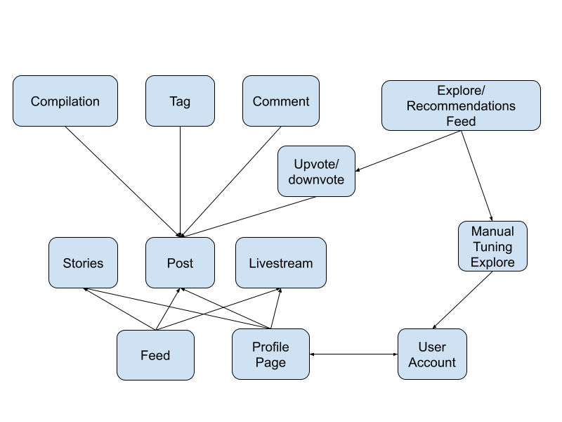
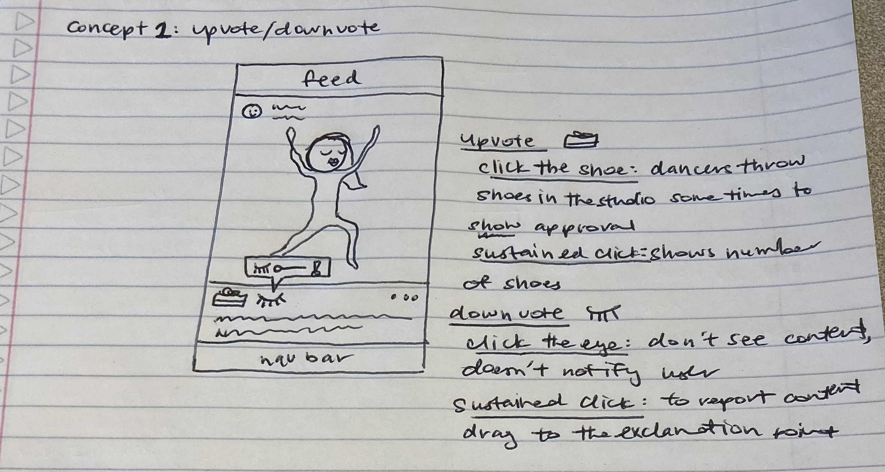
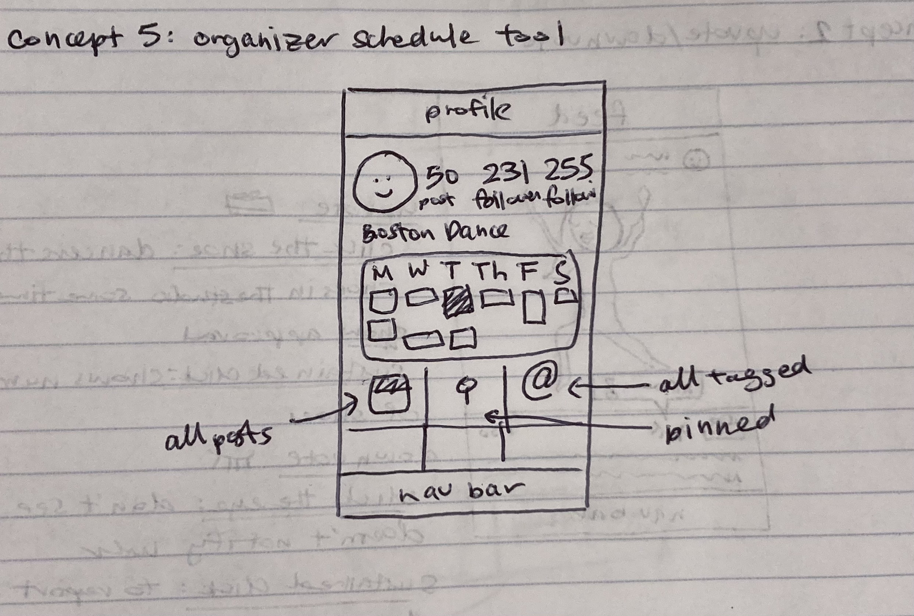

# A2. Divergent Design

## Goal

**Name:** Kah *the sound of a snare which dancers say instead of counting*

**Audience:** Dancers of all skill-levels looking to improve and connect with their dance community

**Value:** Personal space for tracking progress through videos as well as sharing progress with fellow dancers

## Brainstorming Features
*Brainstormed with Rachel Robinson.*
1. User Account Type: Personal and Organization
2. Organization Story: For bumping events 
3. Organization Schedule: on their profile, they live update their classes/registration status
4. Tag Accounts: Other dancers and “DC” (dance challenge), or choreographer credit
5. Tag Song: Allow song to play without copyright, and collect all songs in an exportable playlist of song on acc
6. Tag Techniques: List techniques in caption that you’re currently working on, in post and bio
7. View tag collection: view all videos related to technique, song, or dancer, that is on your account or on the web
8. Wrapped: Yearly automatically generated progress video, along with songs, and techniques most oftenly mentioned
9. Explore feed: A mix between Instagram explore and Tinder, where dance videos are recommended based on your personal explore settings
10. Personal explore settings: inspired by dating apps, use highly tunable feature ranges including distance, genre, and age, complete with deal breaker flags.
11. Public sessions: live streaming instructors? For pay/free?
12. Mark tutorials and the original dance challenge video differently.
13. Users are linked to other users as followers or following and can see each others followers/followings.
14. Challenge feature: generate a challenge to work on for next video
15. Private posting: allow those videos to be super personal like a diary
16. Post: video, caption, comments, and reactions. I.e. users can react to posts using likes, comments, downvote, and report.

## VSD Analysis Insights
1. **(VALUE)** I observe that Kah might get dancers to compete amongst each other, or brew a toxic mindset, from comparing not only skill-level and grindiness (how hard they work) but also how much attention they get on the app.
Thus, for the reaction feature (Feature 16): the app doesn't display likes and comment numbers until you click another button to see more info. Additionally, to address the scope of their skill comparison, user accounts can limit the number of people their account is allowed to follow (forcing them to be picky), and adjust this number in their settings.

2. **(VALUE)** I observe that there is a value tension between exploration of dance styles and self expression (i.e. retention of local and personal style). 
Thus, in the personal explore settings (Feature 10), there should be an option to turn off the explore feed and hide their account froom their followers for a while. Additionally, as a reaction (Feature 16), one option should be a downvote feature to don't suggest posts like this. 

3. **(PERVASIVENESS)** I observe that widespread use of the app would mean dancers from all over the world presenting different genres of dance in different regional styles. It would be cool to visualize the regional differences in dance cultures and style.  
Thus, another tag could be added (in addition to Features 4,5, and 6), for location. A cool additional feature would be to see the intersection of tags, what is breakdancing in Tokyo like? What dance studios are getting the most traction? 

4. **(STAKEHOLDERS)** I observe that the app is vulnerable to the same non-targeted use of all video sharing apps: NSFW/violent, spam (non-dance content).
Thus, any post should have the option to report and give the reason (Feature 16), which in case of NSFW/violent/spam content, should hide the post from all users until further review. An added feature, should be blocking or reporting accounts.

5. **(STAKEHOLDERS + TIME)** I observe that the app might be a good way to evaluate dancers from a recruitment perspective, and with enough time the app may fill up the space of a portfolio for professional dancers. 
Thus, either the app leans into this, and creates an account type for recruiters, or maintains a homey environment throughout the app. A potential feature should include a way to highlight certain videos for users who are in the professional field (i.e. either through pins that are seen by all users or by recruiter accounts).

## Concepts
1. Post: users share a single video (max one minute) to both their profile and feed, with additional data like captions, location, and tags, that other users can react to.

*@sally_dances posted a video of her practicing @billie_jeen's choreography at the @5678_studio in Pasadena to "Me" by H.E.R. (tags dancer, studio, location, and song). She is working on isolations (tags technique)."*

2. Upvote/Downvote: users like/hide posts. Like shows support to other users and indicate to the recommendations to show more content like this, and hide indicates to show less content like this.

*@zakaria01 is tired of seeing dance challenges, and hides every post on their feed/explore that is a trendy dance challenge. They only like posts of freestyle sessions.*

3. Tag: users label their posts--song and location (can only tag one per video), and featured users and techniques (can tag multiple per video)--for easy recall for their own posts and the webs posts.

*@sally_dances clicks on the #isolations tag of her post and sees 25 videos she's posted in the past of her working on isolations. She clicks on a toggle and sees all videos working on isolations in order of relevance.*

4. Recommendation/Explore Manual Tuning: Other than the automated Upvote/Downvote, the user has more agency (control over their consumption) because of a dating-app like preference setting for geographical proximity, genre, dancer age, and etc, and turning. They can also turn off recommendations/explore and put their profile on inactive.

*@zakaria01 is tired of seeing other dancers and needs a recuperation period. They turn off recommendations/explore and hide their account from all their followers, all their posts become available only to them until this is toggled back to active*

5. Account Type: Users can create an account that is for dancers (default) or organizers, the second major stakeholder in the dance industry: dance studios, teams, instructors, and etc. Organizers have schedule/registration functionality.

*@sally_dances signs up for the Tuesday 7p.m. krump workshop that has 24 available spots, all on @BostonDance's profile.*

6. Live: Both organizers and dancers can livestream video events for a live audience.

*@zakaria01 is live now, according to the stories section, and teaching a free workshop on popping that they'd advertised on their story.*

7. Stories: Dancers and Organizers can post ephemeral content (picture/video with text) that disappears after 24 hours. Organizer stories are prioritized especialy if linked to schedule.

*@jj_bean checks that only three dancers are signed up for the @BostonDance workshop tonight and guesses correctly that they're going to cancel. @BostonDance updates their calendar and story that the workshop has been cancelled.*

8. Compilations: Users at the end of the calendar year get an exportable video and music playlist that commemorate a years worth of growth. 

*@jj_bean opens the app to a pop-up notification: a video compiles their 30 dance videos in that order, and shows their top 3 techniques, and most commonly watched genre. They export the video to their Instagram story.*

## Dependence Diagram

## Concept UI

