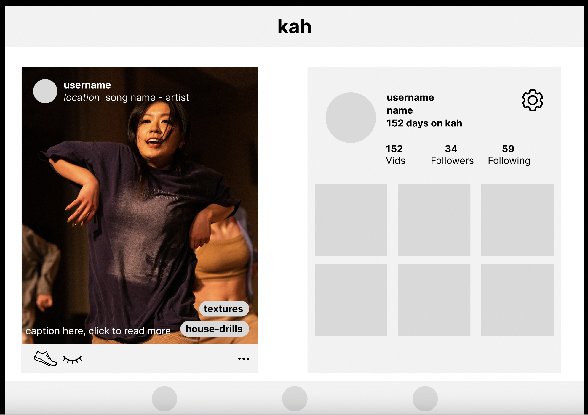
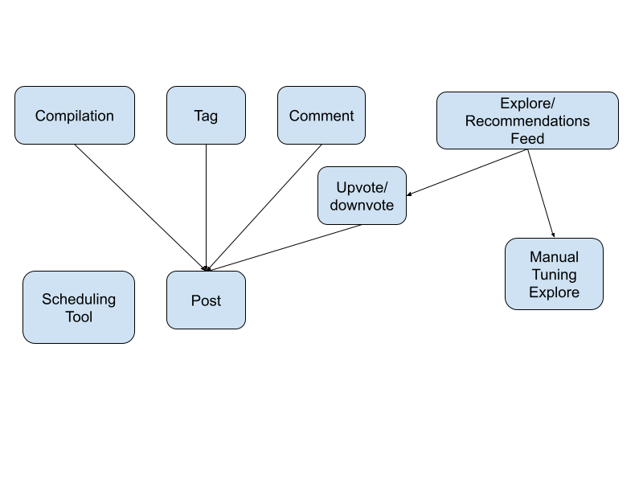
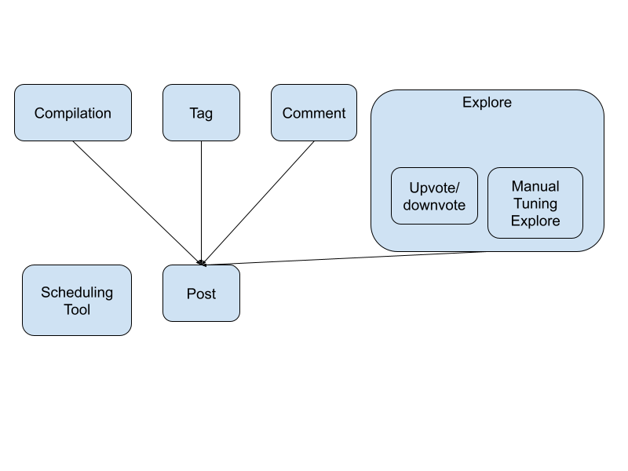

# A3. Convergent Design

## Pitch

Kah, is the sound of a snare dancers say out loud to supplement their counting during practice. Kah, is an app for dancers who want to track their progress and share their videos in a safe space that values learning and community over internet fame and virality. 

From my own experience as well as the experiences of the two dancers I interviewed, watching videos of oneself practicing choreography, freestyle, and technique combinations are critical to improving dance: three out of three times being called the most effective way to improve dance fast. Thus, it’s nice to have a system that collects, labels, commemorates and shares this personal journey. 

The key functions are: posts (videos), upvote, tag, following, following feed, profile, explore, scheduling, dancer/organizer account type, stories, and compilations. Essentially both dancers and organizers can create accounts and share videos to their followers, and dancers can go on the profile page of organizers. They can consume dance videos from their feed, profile, explore page, or by clicking through tags. Additionally they can control their explore recommendations in their settings: a feature that very intentional artists who care to curate their content consumption might value (Interview 2).

## Functional Design

**concept Posts**

    Purpose: share video that can be engaged with

    Principle: a user shares a video of dance that is associated with data 
        (captions, tags, likes, and comments, user) and shows up in their profile 
        and the feed of other users based on restriction level

    State: 
        Videos: PostID -> Videos
        Captions: PostID -> string
        Tags: PostID -> {Location: string, Song: string, Accounts: Users, Technique: string}
        Likes: PostID -> Users
        Comments: PostID -> Comments
        Restriction: PostID -> {Public | Private | Personal}

    Actions: 
        // user adds a comment during a session
        add_comment(user: Users, body: "string")
            Comments.add{Comment(user, body)}

        add_like(user)
            Likes.add(user)
        
        // user clicks a tag of the post and views collection
        get_tag_collection(tag)

        change_restriction(newRestriction: Restriction)
            Restriction = newRestriction

        // based on restrictions, returns the post
        render(user)

**concept Explore**

    Purpose: recommend videos for user based on user preferences and upvote history (synchronization).

    Principle: user manually sets preferences for different metrics (location, genre, 
        age, and etc) and gets a personalized method of ranking relevance of 
        suggested public posts

    State:
        all_available_posts: Posts
        upvote_history: user -> Posts
        location_preference: user -> (Number, Number)
        genre_preference: user -> tags
        age: user -> (Number, Number)
    
    Actions: 
        // from a set of viable posts, return ranked list of posts by perceived relevance
        sort_by_relevance(posts)

**concept Tags**
    
    Purpose: labels on videos to see in collections of multiple videos
    
    Principle: user issues four types of tags on their own post (song, user, 
        technique, location) that all users can click to see collections of.
    
    State:
        tagCollections: tagID -> Array<PostID>
        type: {songs: songs, users: Users, technique: string, location: string}
        tagName: tagID -> string
    
    Action:
        // return tag collection but only posted by given user
        getTagFilteredbyUser(user)

        // return tag collection but for all accessible to user in session
        getTagCollectionAll()

**concept Compilation**
    
    Purpose: let users look back at their progress by automating a video compilation of 
        their posts.
    
    Principle: at time T at the end of the year, all users receive pending post 
        that contains a video compilation/summary of the users videos, tags, and 
        user interactions.
    
    State:
        compilations: userID -> Video

    Action:
        // generate compilation for user for last year's posts
        generateCompilation(user, date)

**concept Scheduler**
    
    Purpose: Organizers can add class events to a calendar on their profile, which 
        students can sign up for (reserve a spot on a first come first serve basis)
    
    Principle: when class event becomes available for sign up, capacity number of 
        users can register for the class by clicking on the calendar event on the 
        organizer's 
    
    State:
        Calendars: OrganizerID
        Events: EventID -> OrganizerID
        Capacities: EventID -> Capacity
        Registration: EventID -> Users
        EventDate: EventID -> Date

    Action:
        // based on capacity, current registration, and event date
        isEventAvailable(EventID): True/False

        register(EventID, user)
        
        addEvent(user, date, capacity)

**concept Comments**
    
    Purpose: users can leave nested messages under a post.
    
    Principle: user send a comment on a post or comment.
    
    State:
        comment_source: CommentID -> CommentID | PostID
    
    Action:

        addComment(user, source: CommentID | PostID)

        getComments(PostID): Comments

## Wireframes
<iframe style="border: 1px solid rgba(0, 0, 0, 0.1);" width="800" height="450" src="https://www.figma.com/embed?embed_host=share&url=https%3A%2F%2Fwww.figma.com%2Ffile%2FF9F6GshDa9VXj6otap5Cek%2Fkah%3Ftype%3Ddesign%26node-id%3D4%253A17%26mode%3Ddesign%26t%3DIeHpaVkzyIUwbuub-1" allowfullscreen></iframe>

figma: https://www.figma.com/file/F9F6GshDa9VXj6otap5Cek/kah?type=design&node-id=4%3A17&mode=design&t=IeHpaVkzyIUwbuub-1 

## Design Iterations

Iteration 1: 

Iteration 2: 

## Design Tradeoffs

**Automated vs. Curated Recommendation**

Although discovering new non-regional things is a unique benefit of the internet, some dancers don't like the mindless spew of the algorithm (see interviews). Thus there is a mix of automated (upvote/downvote) and manual recommendation tuning as options.

**Tracking Data vs. Comparing Statistics**

Followers are displayed but hopefully dancers don't compare each others meaningless statistics. 

**Showing Approval vs. Doom-scrolling**

Throwing shoes are the way of liking on this app. As a display of appreciation, hopefully will get people to scroll more meaningfully. Although the endless feed is part of the toxic doom-scrolling phenonmenon in social media. 
