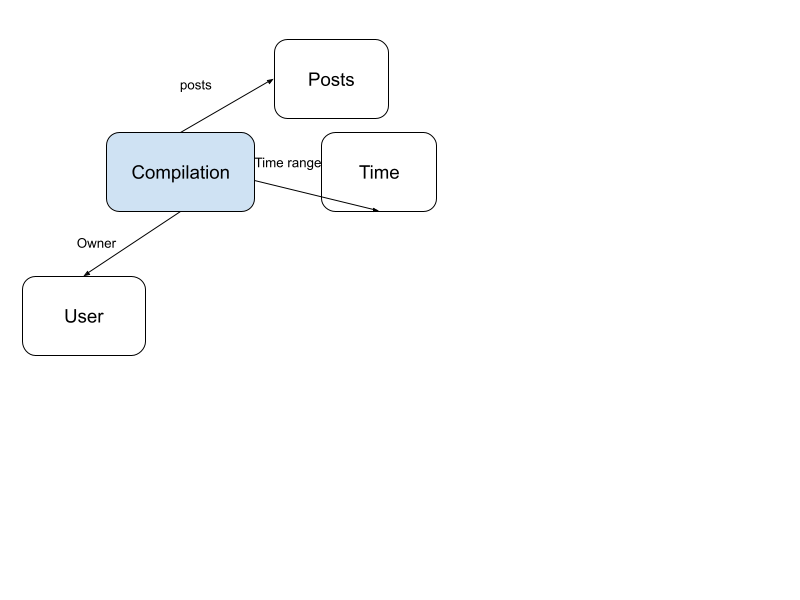
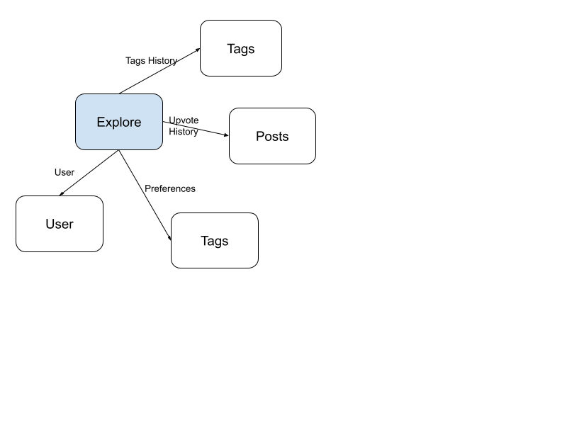

# Backend: Milestone

## Abstract Data Models

## Concept Implementations

See repo below for two concept implementations (comment and tag): 
https://github.com/lvcyklm02/backend-starter/tree/main/server/concepts 

## Vercel Deployment

See publicly available deployment:
https://backend-starter-dazqe03di-lvcyklm02s-projects.vercel.app/ 

## RESTful routes

See repo below for routes:
https://github.com/lvcyklm02/backend-starter/blob/main/server/routes.ts 