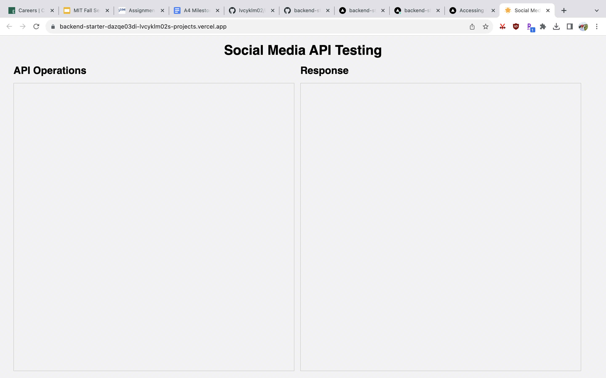

## Concept Implementations

See repo below for two concept implementations (comment and tag): 
https://github.com/lvcyklm02/backend-starter/tree/main/server/concepts 

## Vercel Deployment

See publicly available deployment:
https://backend-starter-dazqe03di-lvcyklm02s-projects.vercel.app/ 

## RESTful routes

See repo below for routes:
https://github.com/lvcyklm02/backend-starter/blob/main/server/routes.ts 

## Design Reflection

Once I started my implementation of my backend, I realized I unified a lot of different features (Location, account, genre, techniques) into one concept Tag. I think I'm going to continue developing a Tag concept and differentiate initiation of doc collections at the application level and routing. I additionally realized a big concept like a scheduler needs many concept-size parts like event (with registration functionality), calendar. 