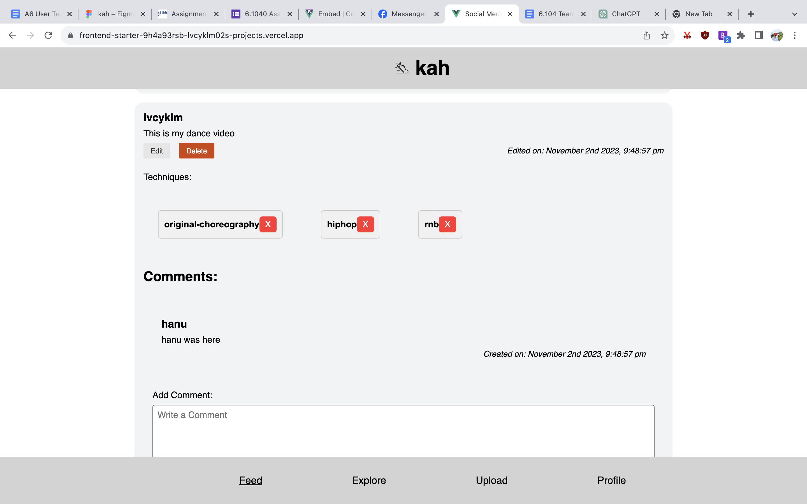
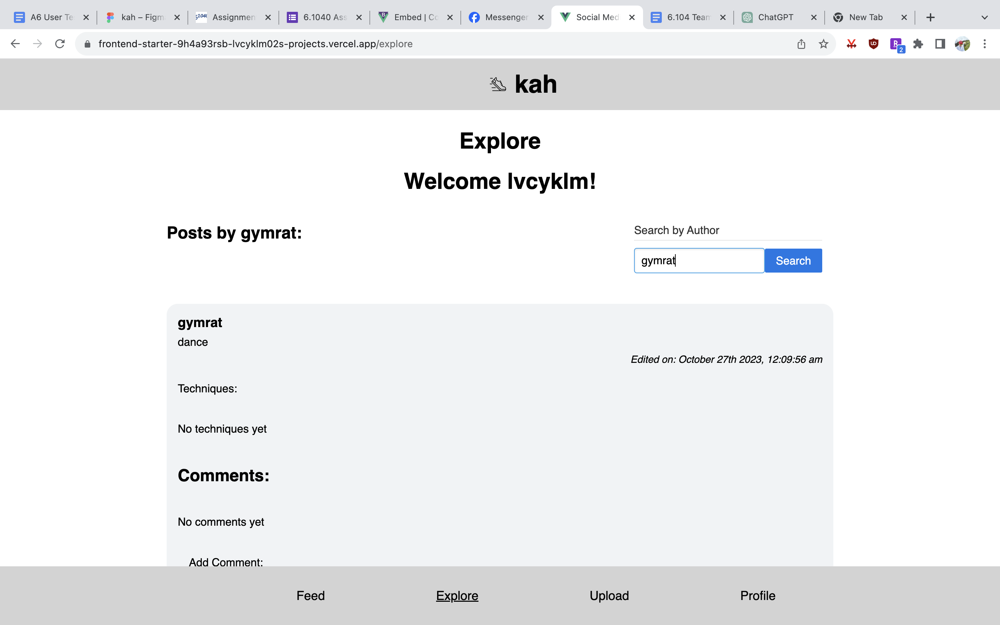
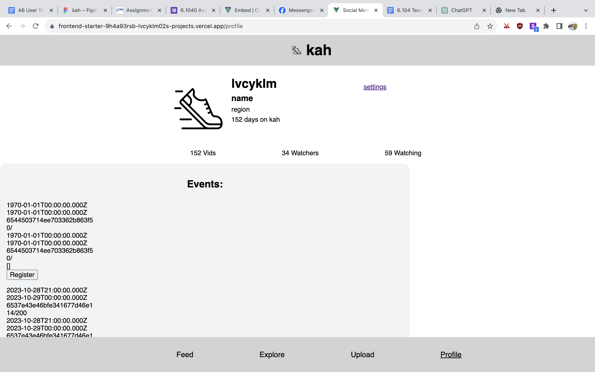

# User Testing and Analysis

Link to Vercel: https://frontend-starter-9h4a93rsb-lvcyklm02s-projects.vercel.app

## Prepopulated Data

## Task List

<table>
  <tr>
    <th>Task</th>
    <th>Instruction</th>
    <th>Rationale</th>
  </tr>
  <tr>
    <td>Build a post with techniques</td>
    <td>Go to the Upload page and write a meaningful caption and add technique tags and generate the post.</td>
    <td>Testing the main functionality of content generation in the app. I’m looking for whether they can see there being use in the tag feature, and whether they can exploit any of the current features.</td>
  </tr>
  <tr>
    <td>Create an event and yourself to the roster. </td>
    <td>Go to your profile and create an event. See it repopulate the events at the top of your profile, and add yourself to the roster. </td>
    <td>Testing whether the current implementation, although very rough, is confusing or if there are room for conceptual changes. What events for example are useful for dance, can they link this to the original need from interviews.</td>
  </tr>
  <tr>
    <td>Write a comment on somebody else’s post.</td>
    <td>Generate a comment on somebody else’s post.</td>
    <td>I wanted to check reactions of whether or not the main interaction capacity of kah was enough or there was a need for nested comments, like or management.</td>
  </tr>
  <tr>
    <td>Search for somebody else’s post in the explore.</td>
    <td>Submit somebody else’s username.</td>
    <td>Currently, you can only search by username. Wanted to see what kinds of search users wanted to search for.</td>
  </tr>
  <tr>
    <td>Try deleting content.</td>
    <td>Delete post and delete a comment. Delete a tag.</td>
    <td>I wanted to see whether the app currently matches the expected behavior of the users with displaying content from deleted accounts.</td>
  </tr>
</table>

## Study Report 1

In the first user test of kah, the user went through all first tasks quite quickly, and spent the rest of the time exploring edge cases. Upon first opening the website link, and creating an account, the user was surprised to see that other user content was already present on the app's feed, instead of being blank, as they expected following and follower functionality. In the next few tasks, she gave very positive feedback, including describing the division of the app and the post creation process as "super intuitive," which is a positive sign for user-friendliness.

However, some challenges and suggestions were also raised during the testing. First, there was confusion regarding the events feature: the user expressed uncertainty about which event was theirs, because the events were all showing up in gibberish (Mongodb ObjectIds). Additionally, the user pointed out a bug where each event capacity was reported as zero. Lastly, she showed that she could set an event date to "-1”: another bug. In general, she indicated a need for better event management and clarity.

The user also expressed a desire for more robust comment features and some moderation features. The user wished for the ability to mention or nest comments using "@" functionality, which could enhance interaction and safety. More on safety: they encountered a situation where a concurrent user was “doxxing” them, but couldn’t delete their comments on her own post. They also wanted moderation ability also in the context of handling deleted user comments. 

Most importantly, she wanted to see the following features in the app: the ability to upload files and media, autofill techniques based on tag popularity or preset tags, and an explore search that allows for some typos. 

## Study Report 2

User 2 was very good at finding and highlighting certain aspects of the app experience that were unexpected. 

One issue mentioned was that the feed reordered all posts after the user edited his post, which could lead to confusion for users looking for a post right after making an edit.

While testing the techniques tags, he questioned the purpose of "X" symbols associated with tags, indicating a lack of clarity or confusion surrounding this feature. He expressed a desire to be able to delete tags created by others, and was surprised that this was not allowed, feeling deceived by the presence of the "X" symbols on all tags. He mentioned maybe the X’s should only appear when you are editing the post itself, and was disappointed that the edit post option didn’t allow you to edit techniques, suggesting a desire for more comprehensive edit options within the app. There were also issues related to the displaying of techniques. Users found that when they added a significant number of techniques, they started overflowing, indicating the need for better handling of such content. 

The user also identified challenges related to the explore and filter functionality. Deleting content in the explore section caused the filter/explore panel to reset, which disrupted the search experience. Furthermore, user reported an inability to search for comments, but recognized that this was not a common function on social media.

In terms of comments, the user observed that the app allows him to spam comments multiple times before issuing an error, suggesting a need for enhanced comment moderation or error prevention. Another unexpected edge case he discovered was that he could use emojis in the username and techniques (because they’re unicode characters) and thus fake a verified symbol.

To conclude, the feedback from the user test suggests several areas of concern and potential enhancements, including addressing unexpected behavior, improving tag management, enabling more comprehensive editing, refining the explore and filter features, and optimizing the handling of techniques and comments. These insights can guide future development and improvements.

## Design Flaws
- **Media Content:** First off, media is a critical part of the app that needs to be embedded because of the "dance progress tracking" concept. Users pointed out that should be a priority even in the development of the app, in order for the techniques and profile tracking to make sense. 

- **Improved User Interface and Clarity:** Users found it challenging to understand the display of certain features, like the event details on the profile, "X" symbols on tags, unexpected post order changes by edit recency, techniques overflowing, and emojis being allowed in usernames. Improving these user interfaces for more expected behaviors will make their experience much more secure-feeling and make them more likely to use the app again.

- **Enhanced Comment Moderation and Error Handling:** Both users expressed a strong desire for better comment moderation tools to deal with issues like doxxing, spam, and deleted user content on their posts. These improvements are crucial for creating a safer and more pleasant user experience.

