# Project Phase 2: Divergent Design

## Feature Brainstorming

1. **Adding development projects:**
Users can add new development projects, which contain basic information about the project (location, etc.) and all associated project updates. When users enter a location, projects currently there will be suggested to reduce duplication on the platform.

2. **Adding legislation:**
To discuss development-related local legislation that has been proposed or is currently being considered for enactment, users can add new legislation associated with a certain municipal region.

3. **Project/legislation updates:**
Users can add updates about a project or piece of legislation. These updates can be about progress made, plans changed, a legislative status update, etc.

4. **Project actionable:**
Users can add events (community meetings, town halls, rallies/protests, etc.) associated with projects. Users can then RSVP for these events.

5. **Location-based content:**
Users will be shown the development projects near them in their community (in a certain mile radius) and the legislation relevant to their city.

6. **Feed and map views:**
Users can toggle between a chronological feed of project updates and a map view displaying all the projects within their radius.

7. **User roles:**
Users can indicate their community role (business owner, city official, etc.) after going through a verification process. Each role will have different capabilities (ability to post official city replies to project updates, etc.)

8. **Saving/following projects:**
Users can follow projects that they’re most interested in keeping up with. These projects will be pinned at the top of their feed or appear in a “Saved” tab for easy access.

9. **Search bar for projects and legislation:**
The platform will have a smart search bar where users can see the most popular searches (or trending projects based on user engagement) in their community as search suggestions.

10. **Calendar of upcoming community meetings/events:**
Users can view a calendar of the events that they have RSVPed to, as well as all upcoming events occurring in their community.

11. **Polls for projects and legislation:**
To help gauge public opinion about a project or piece of legislation, users can create polls associated with a project or legislation that other users in the community can vote on.

12. **User opinions on project updates:**
Users can leave comments on project updates to express their opinions on the update. These comments consist of a slider from “I strongly agree/support” to “I strongly disagree/support” as well as text the user can write to elaborate on their opinion. Then, for each project update, the comments will be sorted/categorized into For/Against/Neutral based on the slider responses.

13. **Automated project summaries:**
Each project or legislation will have short GPT-generated summaries of high-level information and the most common user opinions.

14. **Automated daily/weekly briefings:**
Users can view (or be emailed) GPT-generated summaries of the updates and discussions that have happened in their community.

15. **Community moderation:**
To help prevent inappropriate content, users in a community can vote to remove posting privileges for another user in their area.

16. **Viewing other communities:**	
Users can view projects and legislation in other communities that they’re not a part of (outside their mile radius), but they cannot create updates, leave opinions, or vote in polls.

17. **Local statistics:**
Each neighborhood or city will have data like pollution levels, socioeconomic demographics, and other information that users can view.

18. **Facilitating IRL sharing:**
Users can generate a poster for a project or legislation (including a scannable QR code to the project’s page on the platform) that they can print out to distribute or post throughout their neighborhood.

19. **Community leaderboard:**
Each city will have a community leaderboard of the most active/engaged users (based on a number of opinions posted, etc.) on the platform.

20. **User engagement ratings:**
Projects and legislation will have user engagement ratings that indicate how much they’re currently being discussed. These ratings will then be used to determine trending status.

21. **Impact ratings:**
Users can rate how impactful/important they think a project or piece of legislation is. Users can then sort content by this rating to discover the most important issues in their community.

## Concept Outline

### Subset of Features for App:
- Adding development projects
- Adding legislation
- Project/legislation updates
- Project actionable
- Location-based content
- Feed and map views
- User roles
- Calendar of upcoming community meetings/events
- Polls for projects and legislation
- User opinions on project updates
- Viewing other communities

### Basic Structural Concepts: 
- User
- Session
- Upvote
- Favorite
- Follow
- Post
- Feed

### Knowsy Concepts:

1. **Role**
    - **Purpose:** To give certain abilities on the platform (related to posting, for instance) to people who have relevant occupations (like experts and/or city officials).
    - **OP:** Given that the user has already signed up and is currently using the app, the user can request a role through an application process. We will either approve or disapprove that application. If approved, then the user will now have enhanced app abilities allowed for officials. If not approved, the user will only have standard capabilities. 

2. **Project**
    - **Purpose:** To store and group all user posts and information related to a particular place with a specified location.
    - **OP:** A user can create a project that includes related information. Other users can view the project, and users who are located close to the project’s location can interact with and add content to the project. 

3. **Announcement**
    - **Purpose:** To broadcast information over a certain radius given a center location.
    - **OP:** A user can create an announcement, specifying a center location and the radius it wants to broadcast it to. Users within the broadcasting radius will receive this announcement, while users outside of the radius will not receive this announcement. 

4. **Event**
    - **Purpose:** Create actionable with a specific time and location that users can RSVP to and then attend.
    - **OP:** A user can create an event with a specific action, time, and location. Other users who see the event can RSVP to that event, which notifies the creator of the event about the people they can expect to show up.

5. **Poll**
    - **Purpose:** To allow users to survey others on topics where they have to choose between different options.
    - **OP:** When creating a poll, users can specify a prompt and particular options that respondents can then select to record their stance.

6. **Opinion**
    - **Purpose:** To enable users to tell other users about their thoughts/feelings regarding a piece of content and view others’ thoughts in an organized way.
    - **OP:** When a user encounters a piece of content, they can leave a comment that consists of text and a slider to describe their feelings towards the content from “I agree” to “I disagree”. These comments are then grouped into categories (such as “For”, “Against”, or “Neutral”) based on the overall collection of reactions.

## Comparables 

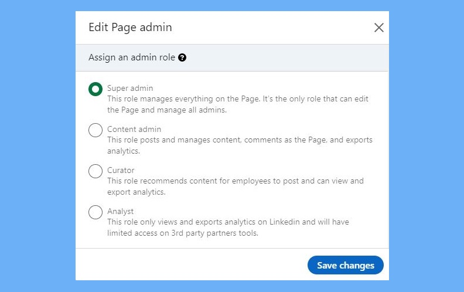
In Linkedin, a specific page for a given organization may allocate different roles to different users. Each role gives that user a specific subset of abilities as shown in the picture above. Similarly, our platform aims to give users the ability to apply for a certain community role that would be verified externally, where a role may give that user some extra abilities. 

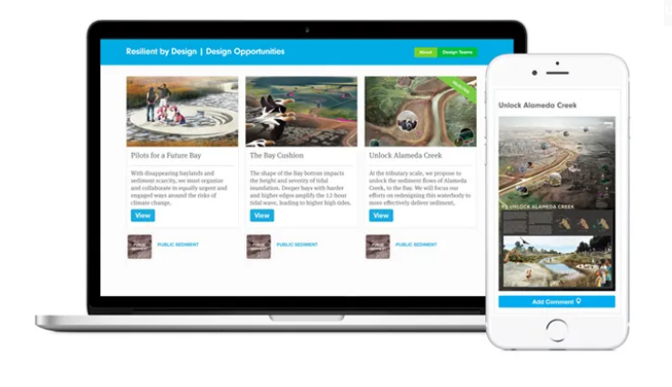
In Neighborland, they categorize each of their major community issues into something very similar to a Project concept, where each group categorization has associated posts and timed events tied back to the group. We aim to use the Project concept as one that can group multiple things into one category, fitting to our platform. 

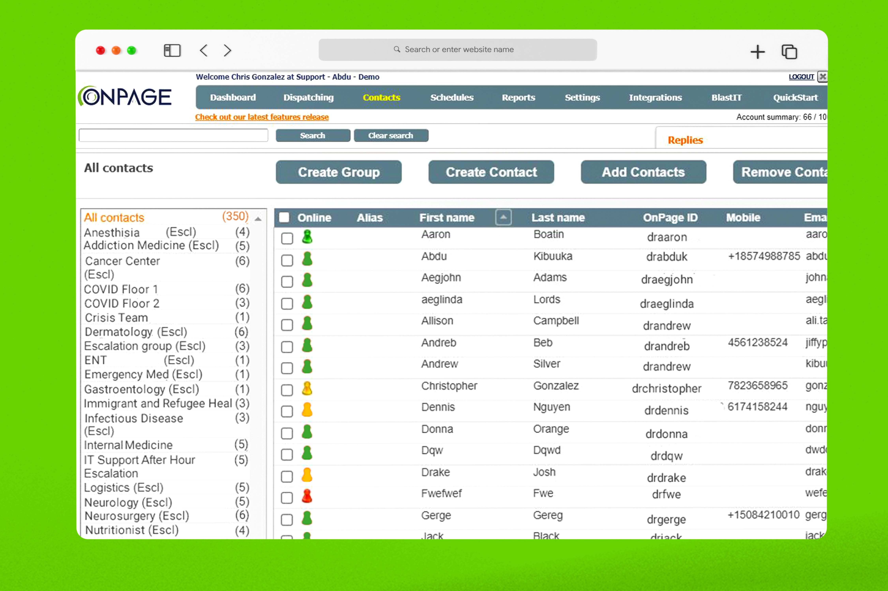
For OnPage, they have this feature where you can choose to notify a group of people, as if you are paging that subset of people. The people who are part of that team are notified and receive the broadcasted message. Likewise, we aim to use the Announcement concept to be able to make sure a specific project appears on a user’s feed if they are within a given zone. 

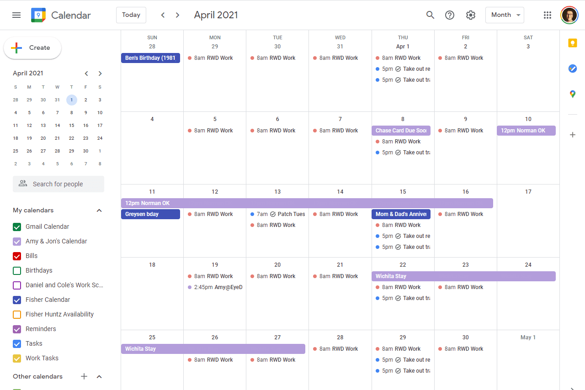
Google Calendar allows you to create events on a specific time, and there are multiple types of scheduling methods, namely events, reminders, and tasks. Each varies slightly on how they relate to time, whether it is a specific time, a broader time, some duration, or perhaps something that can be prolonged infinitely. An Event in our app takes Project as a generic type to create different types of events very similar to GCal, such as fundraisers, petitions, rallies, etc.

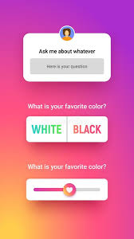
Instagram has reactions that can take various forms, including a slider that can gauge a degree of support, or a poll that can allow users to choose a particular option that they would like to see more of. This feature encompasses both the Poll and Opinion concepts in our app, as we try to use these concepts to allow more ways of engaging with a project, allowing for more community participation and interaction. 

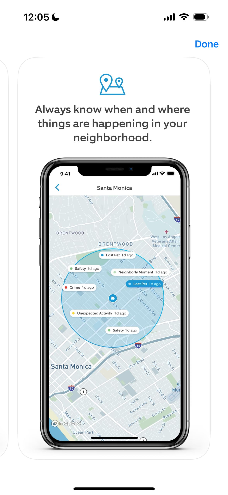
The map in the Neighbors by Ring app shows the date of an incident in addition to location. Similarly, we can use this format to show projects around the community and when they were last updated.

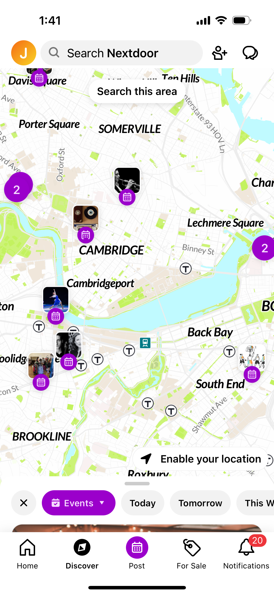
The events map in Nextdoor displays upcoming social events. We can possibly display upcoming community events (community meetings, rallies, etc.) in this way as well in addition to our calendar view.

The Yelp feed shows user updates on nearby restaurants. This is similar to updates on nearby projects, and we can use this for the main user feed on our platform.

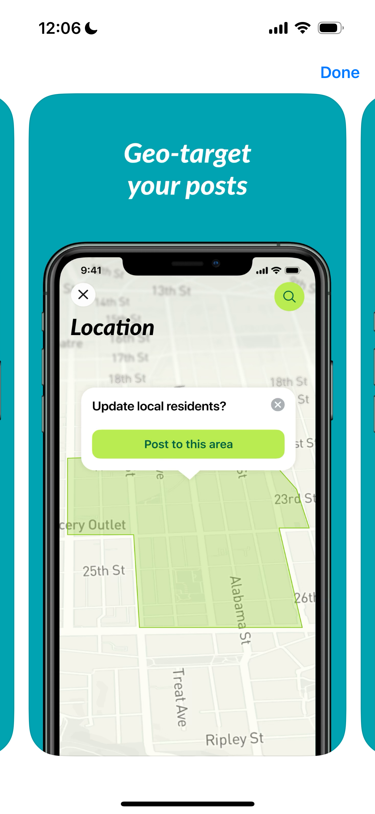
The Nextdoor Agency app has a geo-targeting interface that we can also use in selecting the area for an announcement.

## Storyboard Sketches

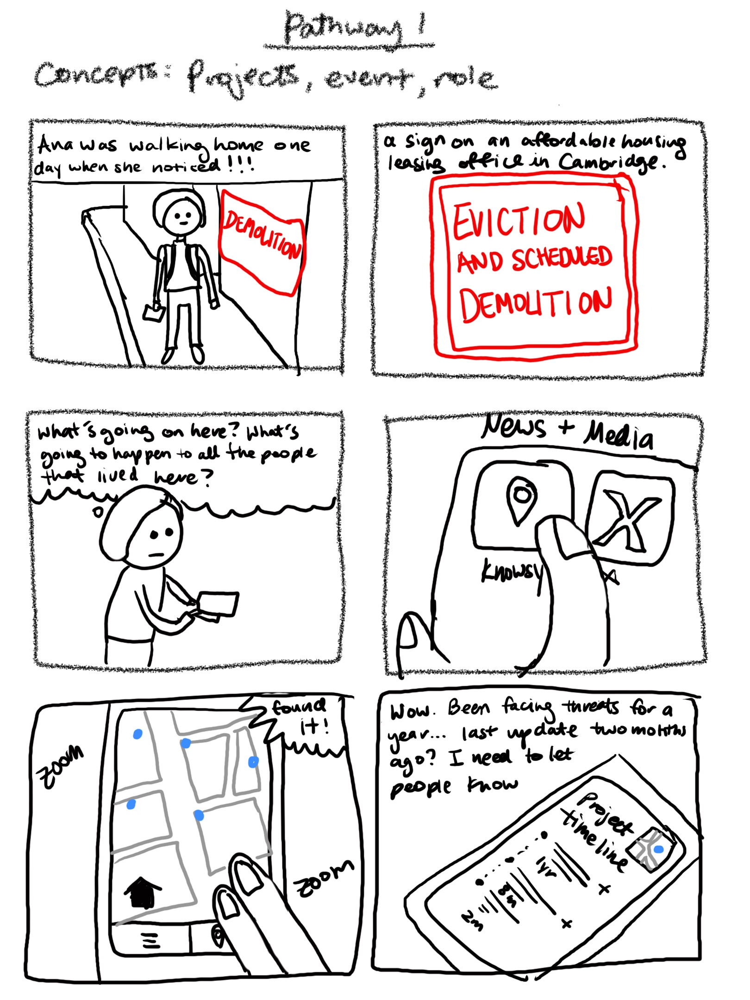
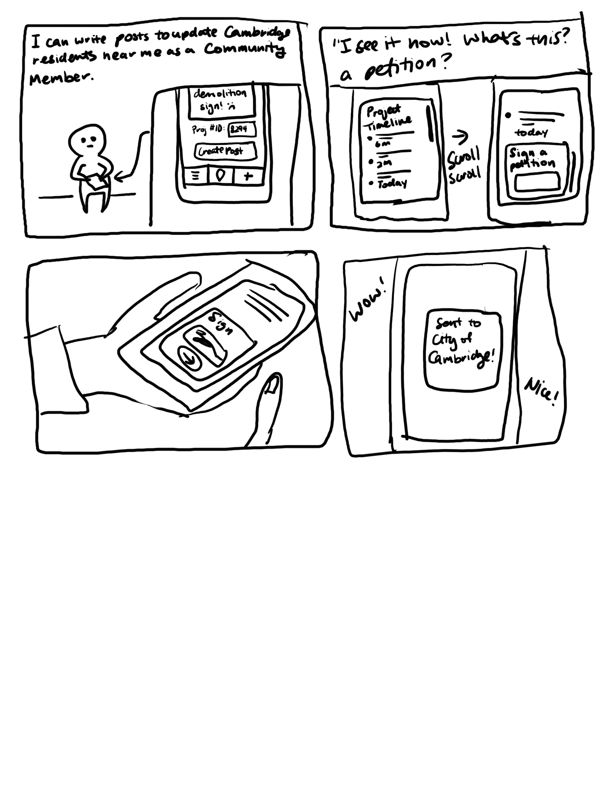
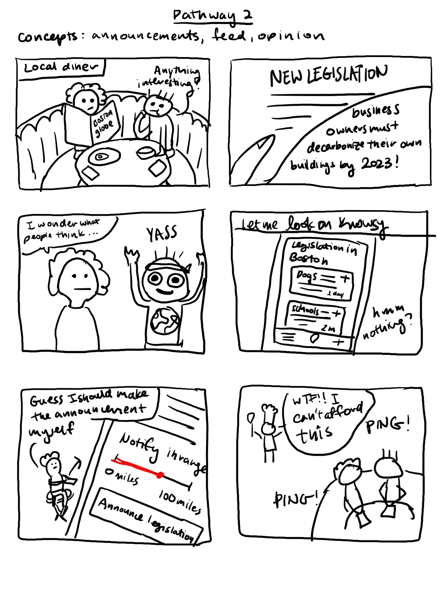
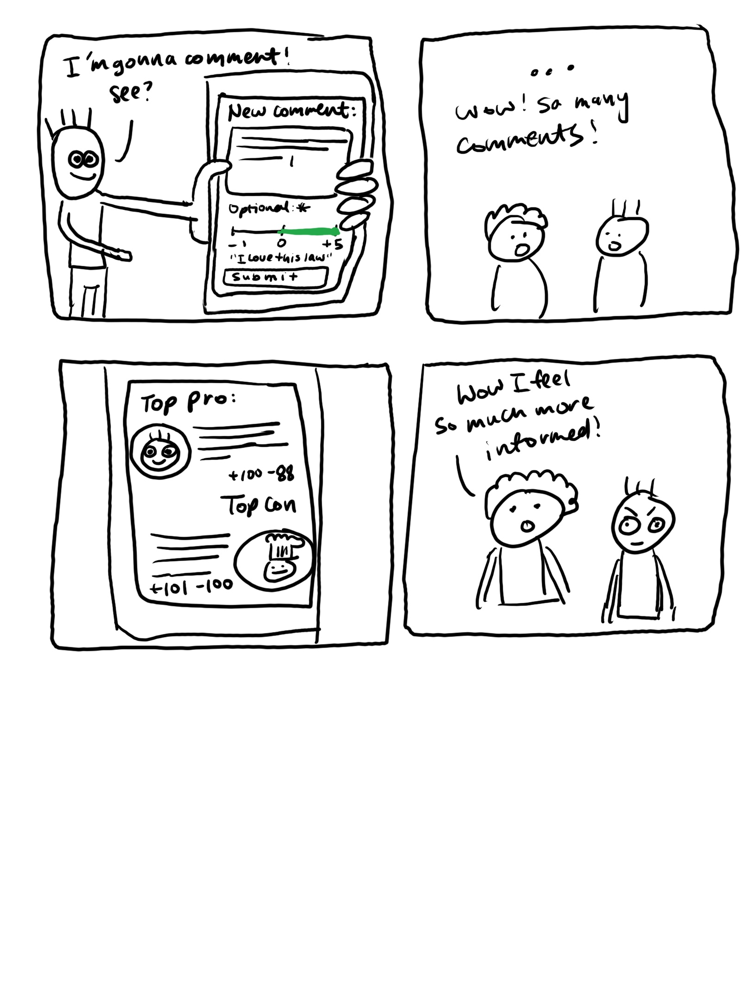
