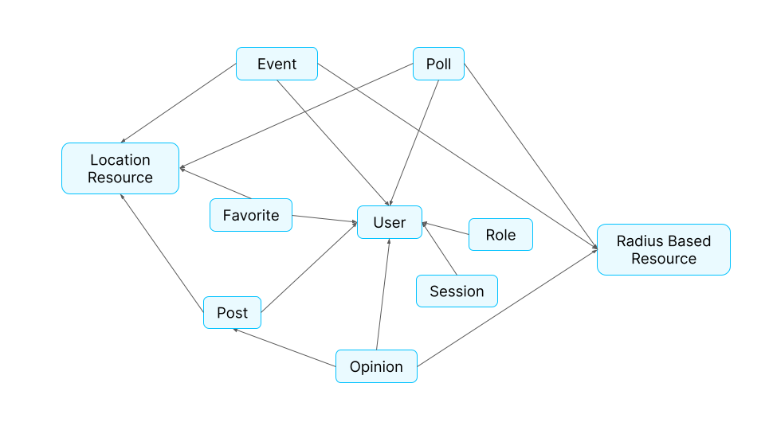
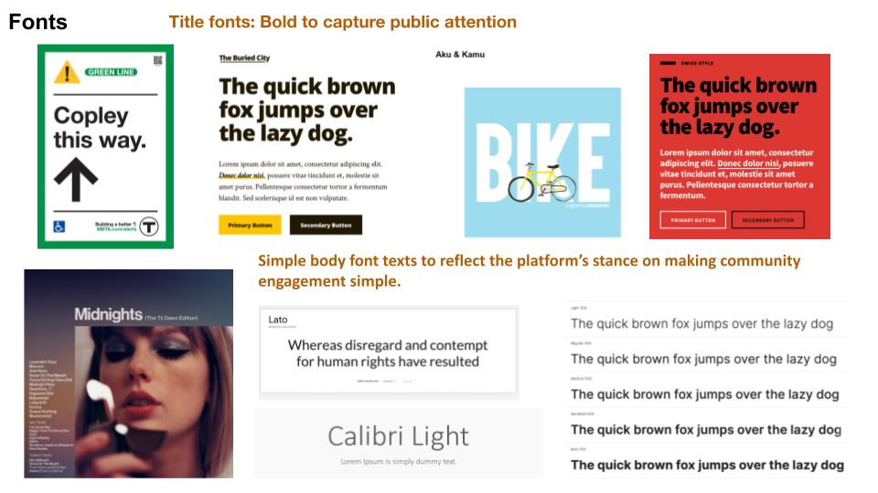
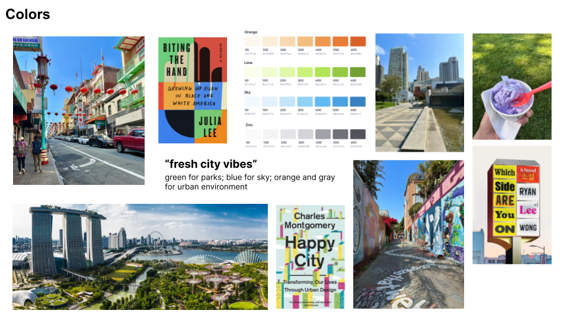

# Project Phase 3: Convergent Design

## Functional Design

### User
**Purpose:** To keep a record of all registered users who use the application and authenticate them when they use the application.

**OP:** When users first use the platform, they must register an account, where all the data associated with their usage of the app is linked to the user.

**State:**
- `users`: set User
- `location`: `users -> one Coordinate`
- `radius`: `users -> one number`
- `username, password`: `users -> one string`

**Actions:**
- `register(username: string, password: string, location: Coordinate)`: 
  - Creates a new user with the corresponding username and password, with some default radius.
- `authenticate(username: string, password: string)`: 
  - Returns the user if the user exists with the corresponding username and password.
- `changeRadius(user: User, radius: number)`: 
  - Changes the radius of a user if that user exists.

### Session[User]
**Purpose:** To give users authentication for a certain period of time.

**OP:** After a session starts and before it ends, a user that is currently active can be obtained.

**State:**
- `active`: set Session
- `user`: `active -> one UserT`

**Actions:**
- `start(u: User, s: Session)`: 
  - If the session is not already active, add this session with the user as the active user.
- `getUser(s: Session)`: 
  - Returns the active user of given session.
- `end(s: Session)`: 
  - If session is active, end it.

### Post[User, Project]
**Purpose:** To share media content with a group of people as determined by its category.

**OP:** A user determines a type of media that they would like to share with a broader group of people and uploads it.

**State:**
- `posts`: set Post
- `author`: `posts -> one User`
- `project`: `posts -> one Project`
- `content`: `posts -> one string`

**Actions:**
- `createPost(author: User, project: Project, content: string)`: 
  - Creates a post with a given author, project label, and content.
- `deletePost(post: Post)`: 
  - Deletes a post given a post ID.
- `getProjectPosts(project: Project)`: 
  - If a given project exists, returns all the post that has that project as its category.

### Favorite[User, Project]
**Purpose:** To allow users to save content that they enjoy and return to it easily.

**OP:** A user chooses some sort of content to save. There will typically be a favorite section that contains all the content that the user has chosen to save.

**State:**
- `favorites`: set Favorite
- `user`: `favorites -> one User`
- `project`: `favorites -> one Project`

**Actions:**
- `addFavorite(user: User, project: Project)`: 
  - Given that the user has not saved a project already, a new favorite object is created with the corresponding user and project.
- `removeFavorite(favorite: Favorite)`: 
  - Given a favorite ID, removes that favorite.
- `getFavorites(user: User)`: 
  - Given a user that exists, return all projects saved by that user.


### Role [User]
**Purpose:** To give certain abilities on the platform (related to posting, for instance) to people who have relevant occupations (like experts and/or city officials).

**OP:** A user can select a role that gives them certain access levels. From the access levels, they can obtain different administrative capabilities within the application.

**States:**
- `roles`: set Roles
- `title`: `roles -> one string`
- `user`: `roles -> one User`
- `isVerified`: `roles -> one boolean`
- `accessLevel`: `roles -> one number`

**Actions:**
- `applyForRole(u: User, title: string, access_level: number)`: 
  - The user applies for a role with a certain access level, creating a Role with given parameters.
- `setRole(role: Role)`: 
  - Once their role application has been approved, their role will obtain functionalities corresponding to their access level (`isVerified = True`). This action deletes any previous roles the user may have had.
- `getRole(user: User)`: 
  - Returns the title and accessLevel of a role of a given user.

### LocationResource
**Purpose:** To store and group all user content and information related to a particular place with a specified location.

**OP:** Location resources are created groups that store a specific location and other possible data. Other content created by any user may then be associated under this location resource, categorizing the content with its specific location and related metadata.

**States:**
- `locationResources`: set LocationResource
- `name`: `locationResource -> one string`
- `start, end`: `locationResource -> one Date`
- `description`: `locationResource -> one string`
- `status`: `locationResource -> one string`
- `location`: `locationResource -> one Coordinate`

**Actions:**
- `createLocationResource(location: Coordinate, name: String, status: String, description: String, start: Date)`: 
  - Creates a location resource with a specific location, status, description, and start date.
- `getLocationResource(location: Coordinate, radius: Number)`: 
  - Given a radius and center location, returns all location resources within the radius.
- `getLocationResourceById(locationResource: LocationResource)`: 
  - Grabs a particular locationResource and returns it.
- `deleteLocationResource(locationResource: LocationResource)`: 
  - Given a locationResource, deletes it.
- `changeLocation(locationResource: LocationResource, newLocation: Coordinate)`: 
  - Changes the location of a locationResource.
- `changeStatus(locationResource: LocationResource, newStatus: String)`: 
  - Changes the status of a locationResource.
- `changeDescription(locationResource: LocationResource, newDescription: String)`: 
  - Changes the description of a locationResource.


### RadiusBasedResource
**Purpose:** To broadcast information over a certain radius given a center location.

**OP:** A user can create a RadiusBasedResource, specifying a center location and the radius to broadcast it. Users within the broadcasting radius will receive this resource, while those outside the radius will not.

**States:**
- `radiusBasedResources`: set RadiusBasedResource
- `name`: `radiusBasedResources -> one string`
- `center`: `radiusBasedResources -> one Coordinate`
- `radius`: `radiusBasedResources -> one number`
- `content`: `radiusBasedResources -> one string`
- `status`: `radiusBasedResources -> one string`
- `criticalDates`: `radiusBasedResources -> set string -> one Date`

**Actions:**
- `createRadiusBasedResource(location: Coordinate, radius: number, name: string, status: String, description: String, criticalDateStrings: []string, criticalDates: []Date)`: 
  - Creates a resource with a specific location, radius, status, description, and critical dates.
- `getRadiusBasedResources(location: Coordinate)`: 
  - Given a location, returns all resources within the broadcasting radius.
- `getRadiusBasedResourceById(radiusBasedResource: RadiusBasedResource)`: 
  - Grabs a particular resource and returns it.
- `deleteRadiusBasedResource(radiusBasedResource: RadiusBasedResource)`: 
  - Deletes a radiusBasedResource.
- `changeLocation(radiusBasedResource: RadiusBasedResource, newLocation: Coordinate)`: 
  - Changes the location of a resource.
- `changeStatus(radiusBasedResource: RadiusBasedResource, status: String)`: 
  - Changes the status of a resource.
- `changeDescription(radiusBasedResource: RadiusBasedResource, newDescription: String)`: 
  - Changes the description of a resource.
- `changeCriticalDates(radiusBasedResource: RadiusBasedResource, newCriticalDateDescriptions: []string, newCriticalDates: []Date)`: 
  - Changes the critical dates of a resource.

### Event[User, T]
**Purpose:** To create actionables with a specific time and location that users can attend, associated with another theme T.

**OP:** Users can create events with a specific action, time, and location. Others can RSVP to the event, notifying the creator about attendees.

**States:**
- `events`: set Event
- `rootTable`: set T -> set Event
- `name`: `events -> one string`
- `type`: `events -> one string`
- `date`: `events -> one Date`
- `location`: `events -> opt Coordinate`
- `attendees`: `events -> set User`

**Actions:**
- `createEvent(name: string, organizer: user, date: Date, type: string)`: 
  - Creates an event with a name, date, type, and user.
- `associateEvent(event: Event, root: T)`: 
  - Associates an event with another object.
- `removeEvent(event: Event)`: 
  - Removes an event.
- `register(user: User, event: Event)`: 
  - Registers a user to an event.
- `unRegister(user: User, event: Event)`: 
  - Unregisters a user from an event.
- `modify(event: Event, name: string, date: Date, type: string, location: Coordinate)`: 
  - Updates event information.
- `getEventsByUser(user: User)`: 
  - Returns events the user participates in.
- `getEventsByRoot(root: ObjectId)`: 
  - Returns events associated with an object.

### Poll[User, T]
**Purpose:** To allow users to survey others on topics with multiple options.

**OP:** Users can create polls with prompts and options. Respondents select options to record their stance.

**States:**
- `polls`: set Poll
- `prompt`: `Poll -> string`
- `options`: `Poll -> set string`
- `votes`: `Poll -> map {User -> one String}`
- `author`: `Poll -> User`
- `project`: `Poll -> T`

**Actions:**
- `createPoll(prompt: string, options: set string, author: User, project: T)`: 
  - Creates a poll with a prompt, options, and author.
- `deletePoll(poll: Poll)`: 
  - Deletes a poll.
- `addVote(user: User, poll: Poll, option: string)`: 
  - Allows a user to vote on a poll.
- `removeVote(user: User, poll: Poll)`: 
  - Removes a user's vote from a poll.

### Opinion[User, T]
**Purpose:** To enable users to express thoughts/feelings about content.

**OP:** Users can leave comments consisting of text and a rating scale to describe their feelings about presented content.

**States:**
- `opinions`: set Opinion
- `rootTable`: set T -> set Opinion
- `author`: `opinions -> one User`
- `content`: `opinions -> string`
- `feeling`: `opinions -> opt number`

**Actions:**
- `createOpinion(author: User, content: string, feeling: number)`: 
  - Creates an opinion attached to a feeling.
- `associateOpinion(opinion: Opinion, root: ObjectId)`: 
  - Populates a lookup table for associated comments.
- `deleteOpinion(opinion: Opinion)`: 
  - Deletes an opinion.
- `getObjectOpinion(object: T)`: 
  - Retrieves all opinions for an object.
- `getUserOpinions(user: User)`: 
  - Retrieves all opinions made by a user.


### Dependency Diagram



### Synchronizations

```
app Knowsy: 
	include User
	include Session[User.User]
	include Post[User.Users, DevelopmentProjects.Projects]
	include Post[User.Users, Announcement.Announcements]
	include Feed[User.Users, Post.Posts, Announcement.Announcements]
	include Favorite[User.Users, DevelopmentProjects.Projects]
	include Role[User.Users]
	include LocationResource
	include RadiusBasedResource
	include Event[User.Users, LocationResource.LocationResources]
	include Event[User.Users, RadiusBasedResource.RadiusBasedResources]
	include Poll[User.Users, LocationResource.LocationResources]
	include Poll[User.Users, RadiusBasedResource.RadiusBasedResources]
	include Opinion[User.Users, Post.Posts]
	include Opinion[User.Users, RadiusBasedResource.RadiusBasedResources]

	sync getProfile(user: User, out post: Post, out opinion: Opinion, out event: Event, out favorite: Favorite) {
		Once the user logs in, a web session is automatically created. Given a
		Web session, we grab the user associated with the web session
		We then go through all of the Posts, Opinions, Events, and Favorites 
		And return all items through all of those collections for the profile page
	}

	sync getLocationResource(user: U, out resources: LocationResource | RadiusBasedResource) {
		// Once the user logs in, we will get all of the location resources and radius-based 
		// resources given the center location of the user and the radius of the user.
		// For location resources, we can just set the center location to the location of the 
		// user and the radius to be the radius set by the user. For radius-based resources, 
		// we return all radius-based resources where the user is within the range of the
		// Resource. 
	}

	sync createOpinionofRoot(user: U, content: string, feeling: number, rootObject: ObjectId){ 
		// A user can create an opinion under a Post or a RadiusBasedResource. 
		// We will call all of the creator functions given the type
		opinion = createOpinion(user, content, feeling);
		associateOpinion(opinion, rootObject)
    }

    sync createEventofRoot(organizer: U, name: string, date: Date, location: Coordinate, rootObject: ObjectId){ 
        // User can create an event that is associated with a RadiusBasedResource or 
        // Location resource.
        event = createEvent(organizer, name, date, location)
        associateEvent(event, rootObject)
    }

```


## Wireframes

<iframe style="border: 1px solid rgba(0, 0, 0, 0.1);" width="800" height="450" src="https://www.figma.com/embed?embed_host=share&url=https%3A%2F%2Fwww.figma.com%2Ffile%2FbIPhBytUG3XQBaIdRLA0dO%2FP3-Knowsy-Wireframing-v1%3Ftype%3Ddesign%26node-id%3D0%253A1%26mode%3Ddesign%26t%3DnHXLFs2K3CrIdxDI-1" allowfullscreen></iframe>

## Heuristic Evaluation

### Usability Criteria

- **Learnability:** Our app has many of the common icons and structures as other apps, allowing users to quickly adapt to the basic features. This involves a search bar at the top, a profile circle with their profile symbol at the top right, and filters by the top left near the search bar. This familiar positioning of features can help the user maneuver the app easily. Similarly, working almost as a forum/feed, it makes sense to press into a specific project/legislation to view its associated information, which is helpfully organized and structured on that specific page (to see comments, posts, location, description, actionables, etc.). One thing that the users might need to learn is that the toggle on the top of the app switches between the map and the feed. Since there are only two options, it keeps the toggle function simple and should be something that users can get used to quickly.

- **Efficiency:** Firstly, the incorporation of our Favorite, LocationResource, and RadiusBasedResource easily divides posts and comments that are about specific development projects and legislation into helpful groups. This allows users to know where to look (or what to search for) when trying to find a specific piece of content. Furthermore, our app has multiple views to look for a specific project or legislation. If perhaps, the user does not remember the name or a piece of text about the content they wish to look for, having a map view allows them to explore and find the desired project/legislation by location if need be, which is something that can be very helpful for an app that bases everything on location.

### Physical Heuristics
- **Fitt’s Law:** Fitt’s Law predicts the difficulty of usability based on the width of the component and the distance from the current cursor to the target location. Many of the major components within our application were created strategically to account for accessibility and ease of use. For example, within a project/legislation, a user can easily recognize and access the poll. Once the user clicks on the poll, instead of transitioning to a new page specifically for the poll, the UI components are reactively replaced with the poll functionalities. This reduces the distance a user needs to travel to access related functionalities pertaining to a certain feature within the app. 

- **Situational Context:** In regards to conveying the current context, I believe there is room for improvement. While we strategically placed certain typography and styling to texts to showcase which component they are currently interacting with, there isn’t really an indicator showing which page or feature the user is on. Of course, the user can infer that they are currently on the feed page, project page, or announcement page. However, I believe it might be beneficial to include a main title heading at the side of the page or some indicator indicating that this is the homepage, legislation page, etc.

### Linguistic Level
- **Consistency:** The project/legislation gems are color-coded on the map: legislation is orange, projects are blue, and both become yellow when saved. These colors are used throughout the app again (i.e. feed’s filter buttons and background color for the feed’s posts) for the users to easily classify the type of content they are dealing with. However, because the color palette is chosen to be limited in the app, the current wireframe reuses these same colors (purely decoratively) for some other form buttons, arbitrary of the function. This inconsistency should be resolved by adding another color that is neutral to the palette of the app, such as green.  

- **Information Scent:** The projects are the most information-dense collection of objects in our app, and they allow users to see a LOT of relevant info at the same time. Thus, once they encounter an interesting post on the feed, they should be able to click on it for details, and then click on the project it’s nested under. The current post page doesn’t make it clear what part of the project’s timeline the post is in, which should be resolved by making the sidebar widget more dynamic, and indicative of the current post’s relative location. 


## Design Study





## Project Plan

**Concept Implementation Order:**
1. User
2. Session
3. Post
4. LocationResource
5. Opinion
6. RadiusBasedResource
7. Event
8. Poll
9. Favorite
10. Role

**Milestone Alpha (Tasks and Deadlines):**
| Concept (by priority) | Database Definition (11/26) | API Calls (11/27) | Front-end (11/29) |
|-----------------|-----------------|-----------------|-----------------|
| User, Session, Post  | Yuebin   | Brian   | Lucy    |
| Location Resource    | Julia   | Yuebin    | Brian   |
| Opinion    | Lucy    | Julia   | Yuebin    |
| Radius Based Resource    | Brian   | Lucy    | Julia    |

**Milestone Beta (Tasks and Deadlines):**
| Concept (by priority) | Database Definition (12/2) | API Calls (12/3) | Front-end (12/5) |
|-----------------|-----------------|-----------------|-----------------|
| Event | Yuebin   | Brian   | Lucy    |
| Poll    | Julia   | Yuebin    | Brian   |
| Favorite   | Lucy    | Julia   | Yuebin    |
| Role    | Brian   | Lucy    | Julia    |

For the alpha submission, we are planning on implementing 6 concepts (including the standard User, Session, and Post concepts) in the order of the list. The rest of the concepts will be implemented during the beta release. If we are running out of time to complete our implementation, we will consider dropping the poll, favorite, and role concepts. If we discover that we need to significantly rethink the scope of our app, we will also consider not implementing radius-based resources (during alpha) or events. After milestone beta, we plan on doing the CSS styling of the platform as a team and will discuss more about user-testing when the assignment comes with more details. 

