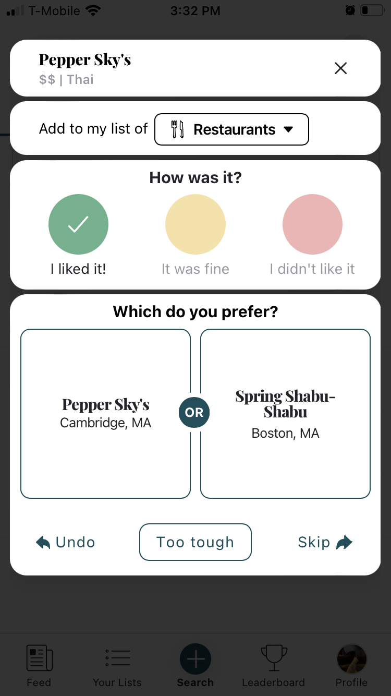
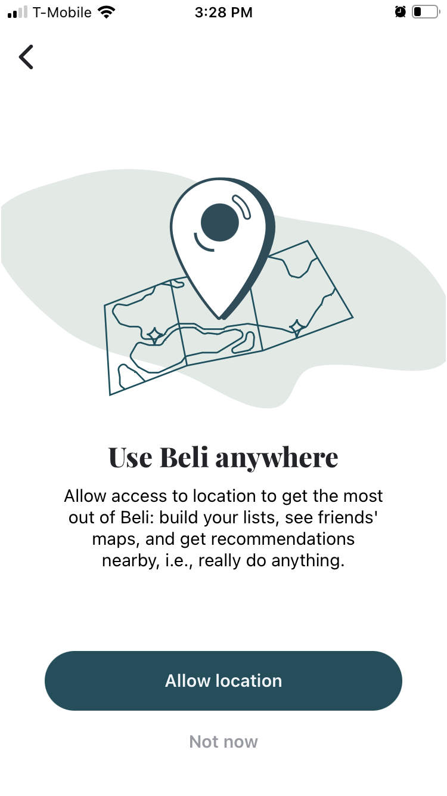

# Innovative Concept Case Study--Beli

I heard about it first from my friend Maya (MIT ‘24) this summer on the way to eat seven-course-beef in Dorchester, which is The Boston spot for authentic viet food.

Launched in 2021 out of Harvard Business School by a foodie couple from New York, Beli is the Yelp for young people: it’s a social media app that allows you to track, find, and share restaurants with your friends, by remembering your preferences. 

I finally downloaded the app today in order to write this blog, because of today’s lecture on innovating by taking simple concepts and exploiting them. I thought of Beli quite naturally because, I believe its real genius lies in two main conceptual innovations. 

## Rating by Ranking

First: Beli merges the ranking concept with the rating concept. Yelp asks users to rate restaurants out of five stars, which puts the burden on the user to hold a consistent standard. Moreover, with a maximum resolution of 0.5 stars, Yelp’s rating system lumps all of a user's experiences into main categories (e.g. bad-okay-great). Beli on the other hand produces a rating but hides the production process from the user’s sight: it asks users to compare restaurants to each other, and uses a comparison sort to rank all their visited restaurants. From here, some kind of standardization is used to produce a number rating out of 10. 

The benefits of this merge are twofold: ratings are less arbitrary. User inconsistency is eliminated: i.e. do you trust all users to develop a rubric and grade restaurants consistently? Second, the app also has more information to work with: they can compare patterns of restaurant rankings amongst users to match similar preference profiles and thus provide more personalized recommendations. 

## Location

Beli’s use of the location concept is innovative because location data is used to build a geographically connected community of users, acting more like a social media than Yelp. 

For example, one feature fires up friendly competition in a community by ranking users by number of reviews or amount of influence. Another one generates the restaurants that are visited most often by users in the area. Location thus is not just a link from user-to-restaurant (by proximity), but also user-to-user (for similar patterns and preferences). 

