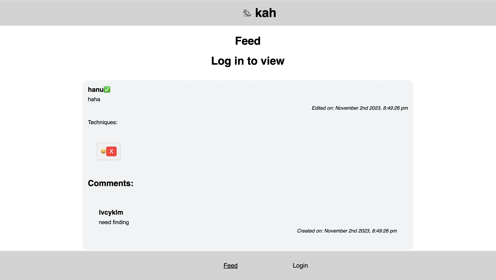

# kah (2023)

## Links 

### Website

https://frontend-starter-kappa.vercel.app/

### Code

https://github.com/lvcyklm02/frontend-starter 

## Pitch

Kah, is the sound of a snare dancers say out loud to supplement their counting during practice. Kah, is an app for dancers who want to track their progress and share their videos in a safe space that values learning and community over internet fame and virality. 

From my own experience as well as the experiences of the two dancers I interviewed, watching videos of oneself practicing choreography, freestyle, and technique combinations are critical to improving dance: three out of three times being called the most effective way to improve dance fast. Thus, it’s nice to have a system that collects, labels, commemorates and shares this personal journey. 

The key functions are: posts (videos), upvote, tag, following, following feed, profile, explore, scheduling, dancer/organizer account type, stories, and compilations. Essentially both dancers and organizers can create accounts and share videos to their followers, and dancers can go on the profile page of organizers. They can consume dance videos from their feed, profile, explore page, or by clicking through tags. Additionally they can control their explore recommendations in their settings: a feature that very intentional artists who care to curate their content consumption might value (Interview 2).

## User Interface
<iframe style="border: 1px solid rgba(0, 0, 0, 0.1);" width="800" height="450" src="https://www.figma.com/embed?embed_host=share&url=https%3A%2F%2Fwww.figma.com%2Ffile%2FF9F6GshDa9VXj6otap5Cek%2Fkah%3Ftype%3Ddesign%26node-id%3D4%253A17%26mode%3Ddesign%26t%3DIeHpaVkzyIUwbuub-1" allowfullscreen></iframe>