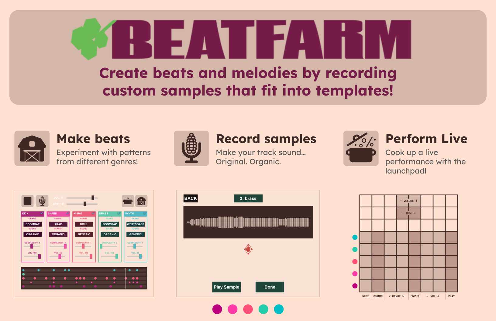
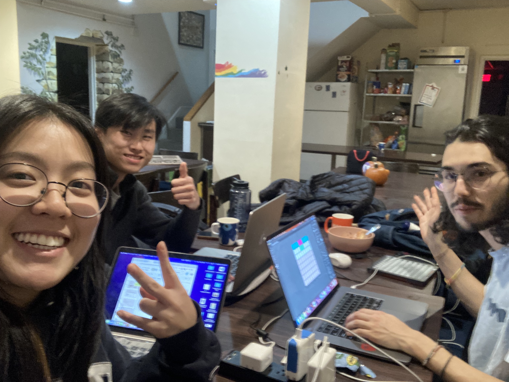

# beatfarm (2023)
**beat producer and organic sound farm**

## Goal
**beatfarm** is a sandbox music app that allows aspiring, creative hip hop beat makers to easily generate and modify beats for rap music or instrumentals.
The app allows users to gain familiarity with standard hip hop music form and theory while guiding them to learn how to layer sounds to create a robust track and express personality by sourcing their own sound clips for each layer/stem (hence the farm)

## Technical
- Designed and implemented a hip hop beat-maker app that blends “organically”-sourced, user-recorded sound samples with generic, user-selected rhythm patterns to make one-of-a-kind beats
- Programmed using Kivy python framework, audio filtered and mastered using Pedalboard (Spotify python library), and supports optional integration of Launchpad hardware for live performance mode

## Inspiration
- Music: https://www.youtube.com/watch?v=I-zeJRjP6xA 
- Software: Garageband smart drums
- Hardware: Pocket Operators

## Team

