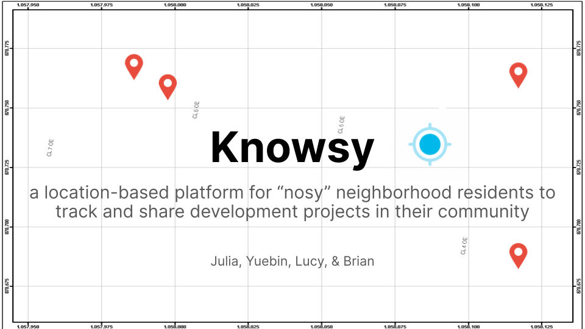
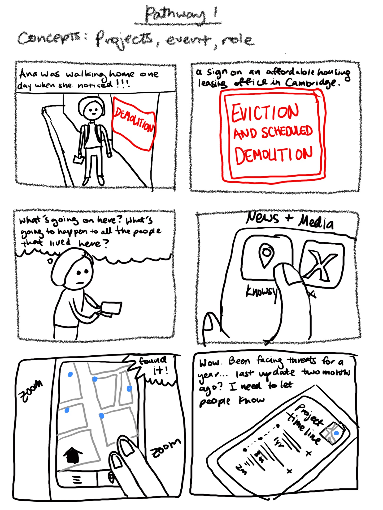
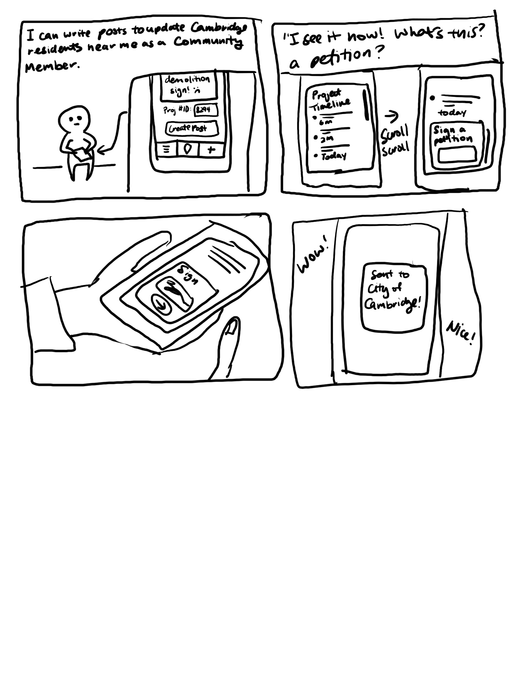
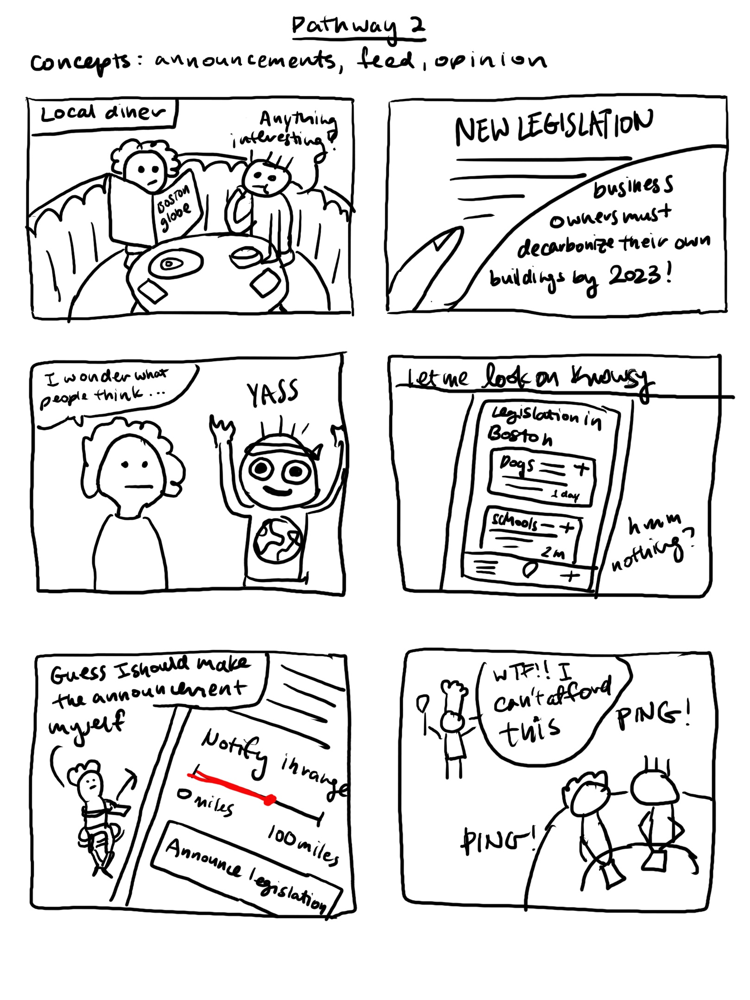
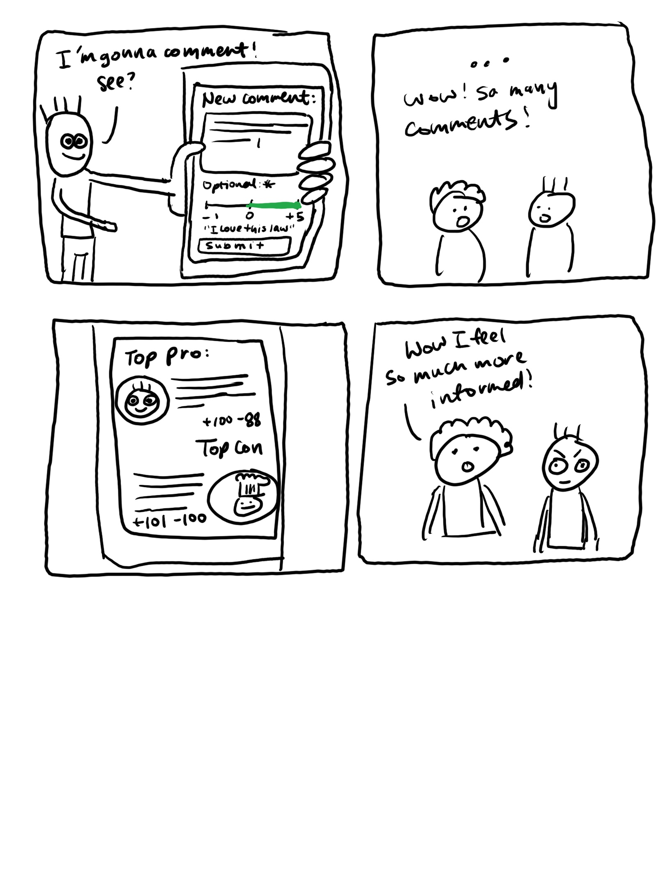

# Knowsy (2023)

## Links

### Demo

https://youtu.be/cyWyL4BzYt0

### Website

https://knowsy-frontend-brian-zhus-projects.vercel.app/

### Code

https://github.com/oasisks/Knowsy-Frontend 

## Context
Final Project for 6.1040 Software Design (Fall 2023) with team members: Julia C., Yuebin H., and Brian Z.

## Impact Case

Currently, civilians are disconnected from the development of their neighborhood’s laws and infrastructure: 1.) civilians have busy lives and self-centered priorities (as the Potential User explained), 2.) civilians are not only uninformed (as the Urban Planning Expert described, residents often lack basic facts and context) but also 3.) civilian opinion is often not used to inform the decision-makers (see Atlantic article in Research findings). Resolving the disconnect between civilians and city development is critical to meeting the needs of residents equitably and more sustainably, mitigating negative trends like gentrification, urban sprawl, etc.   

Our solution to this problem is a user-location-based forum that emphasizes the geographical proximity of a development project to the user’s residence by using a map interface and enabling users to post about and track development projects and legislation in their vicinity. 

We believe this platform is a good solution because it provides a visualization for how projects affect the user by proximity (which incentivizes the user to read, learn, and get involved, addressing the gap from the RPA article in Research findings), and builds a vocal and active base of community members through regular/informed discussion, and provides, as a feature, an intuitive process to move a concern into an in-person actionable (petition/rally). By putting together a one-stop platform that crowdsources and consolidates information about the community from its members, we believe this app addresses the problems mentioned above, as it streamlines the process of community engagement for ordinary citizens by helping them learn about and focus on content that matters most to them. 

We can verify Knowsy's effectiveness in addressing the community's apathy towards local development projects by conducting a direct analysis of local election participation alongside Knowsy usage. Additionally, we can leverage key metrics within the app, including user counts, user growth, user contributions, and geographical reach, to evaluate the platform's influence on community growth and community building. Furthermore, assessing “community satisfaction rates” in specific locales will emphasize the broader impact that citizens have after they have become more engaged in their community.

## Storyboard Sketches

    
    

    
    

## Unique Concepts

1. **Role**
    - **Purpose:** To give certain abilities on the platform (related to posting, for instance) to people who have relevant occupations (like experts and/or city officials).
    - **OP:** Given that the user has already signed up and is currently using the app, the user can request a role through an application process. We will either approve or disapprove that application. If approved, then the user will now have enhanced app abilities allowed for officials. If not approved, the user will only have standard capabilities. 

2. **Project**
    - **Purpose:** To store and group all user posts and information related to a particular place with a specified location.
    - **OP:** A user can create a project that includes related information. Other users can view the project, and users who are located close to the project’s location can interact with and add content to the project. 

3. **Announcement**
    - **Purpose:** To broadcast information over a certain radius given a center location.
    - **OP:** A user can create an announcement, specifying a center location and the radius it wants to broadcast it to. Users within the broadcasting radius will receive this announcement, while users outside of the radius will not receive this announcement. 

4. **Event**
    - **Purpose:** Create actionable with a specific time and location that users can RSVP to and then attend.
    - **OP:** A user can create an event with a specific action, time, and location. Other users who see the event can RSVP to that event, which notifies the creator of the event about the people they can expect to show up.

5. **Poll**
    - **Purpose:** To allow users to survey others on topics where they have to choose between different options.
    - **OP:** When creating a poll, users can specify a prompt and particular options that respondents can then select to record their stance.

6. **Opinion**
    - **Purpose:** To enable users to tell other users about their thoughts/feelings regarding a piece of content and view others’ thoughts in an organized way.
    - **OP:** When a user encounters a piece of content, they can leave a comment that consists of text and a slider to describe their feelings towards the content from “I agree” to “I disagree”. These comments are then grouped into categories (such as “For”, “Against”, or “Neutral”) based on the overall collection of reactions.

## User Interface

<iframe style="border: 1px solid rgba(0, 0, 0, 0.1);" width="800" height="450" src="https://www.figma.com/embed?embed_host=share&url=https%3A%2F%2Fwww.figma.com%2Ffile%2FbIPhBytUG3XQBaIdRLA0dO%2FP3-Knowsy-Wireframing-v1%3Ftype%3Ddesign%26node-id%3D0%253A1%26mode%3Ddesign%26t%3DnHXLFs2K3CrIdxDI-1" allowfullscreen></iframe>

